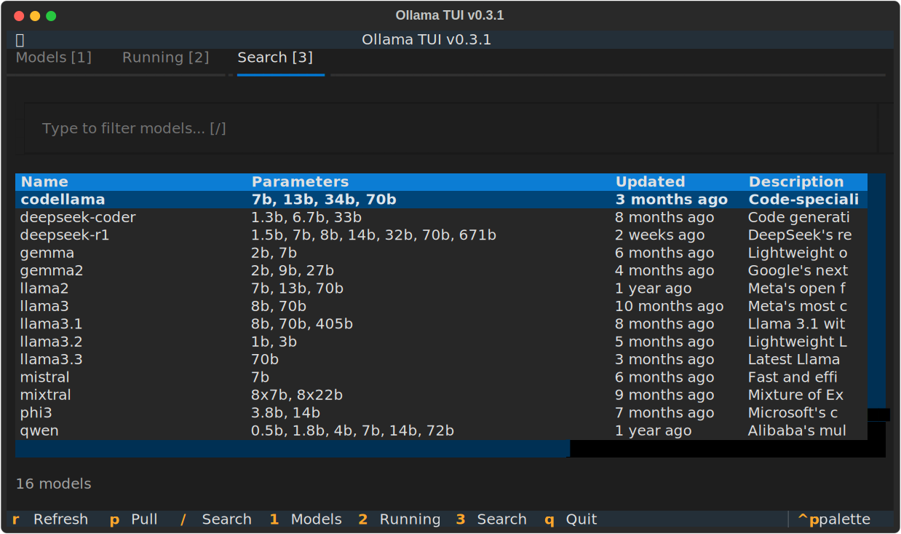
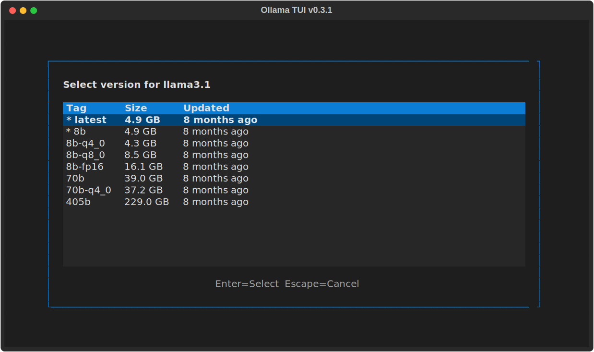
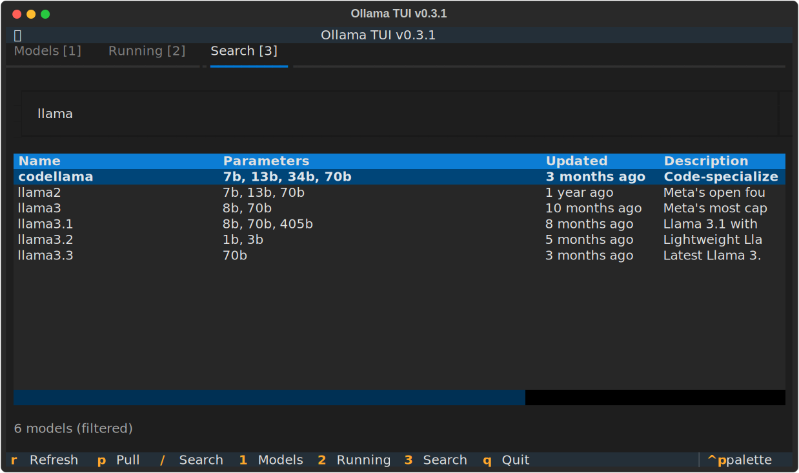
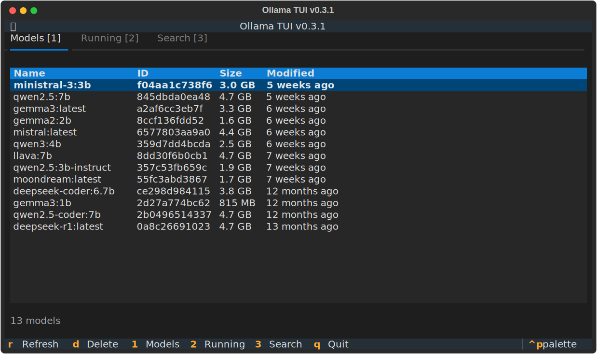
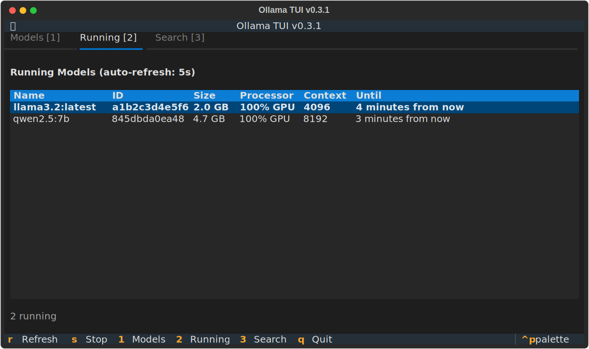

# Ollama CLI TUI

A terminal user interface for managing [Ollama](https://ollama.com) models. Built with Python and [Textual](https://textual.textualize.io/).


## Why This Tool?

The Ollama CLI is powerful but lacks a way to **browse and discover models**. This TUI solves that by scraping the Ollama registry and providing:

- **Full model catalog** - Browse 200+ models with descriptions and parameter sizes
- **Smart search** - Real-time filtering to find the model you need
- **Version selection** - See all available versions with download sizes before pulling
- **One-key actions** - Pull, delete, stop models with single keypresses

No more guessing model names or checking the website - everything is accessible from your terminal.

## Screenshots

### Search & Pull Models
Browse the complete Ollama registry with real-time filtering. See model parameters and descriptions at a glance.



### Version Selection
When pulling a model, choose the specific version you need. See download sizes before committing.



### Filter Models
Type to instantly filter the model list. Find what you need in seconds.



### Manage Local Models
List, inspect, and delete your downloaded models.



### Monitor Running Models
See which models are loaded in memory with auto-refresh. Stop them when done.



## Features

### Model Discovery (Search Tab)
- Browse **200+ models** from the Ollama registry
- See **parameter sizes** (7b, 13b, 70b, etc.) and descriptions
- **Real-time filtering** - type to search instantly
- **Version selection** - choose specific tags with download sizes
- **Smart caching** - 24h cache reduces network requests

### Local Model Management (Models Tab)
- List all downloaded models with size and modification date
- View detailed model information (architecture, parameters, license)
- Delete models with confirmation

### Process Monitoring (Running Tab)
- Monitor loaded models with GPU/CPU usage
- Auto-refresh every 5 seconds
- Stop running models to free memory

### User Experience
- **Keyboard-first** - Full navigation without mouse
- **Visual progress** - Progress bar during downloads
- **Tab navigation** - Switch views with 1/2/3 or arrow keys

## Requirements

- Python 3.10+
- [Ollama](https://ollama.com) installed and running

## Installation

### Quick Install (Recommended)

```bash
git clone https://github.com/elmisi/ollama-cli-tui.git
cd ollama-cli-tui
./install.sh
```

This creates a virtual environment and installs the `ollama-tui` command to `~/.local/bin/`.

### Uninstall

```bash
./uninstall.sh
```

### Manual Installation

```bash
git clone https://github.com/elmisi/ollama-cli-tui.git
cd ollama-cli-tui
python -m venv venv
source venv/bin/activate
pip install -r requirements.txt
```

## Usage

```bash
ollama-tui              # Run the TUI
ollama-tui --flush-cache  # Clear cached registry data
ollama-tui --version      # Show version
```

If running from source:
```bash
./run.py
# or
PYTHONPATH=src python -m ollama_tui
```

### Caching

Registry data is cached in `~/.cache/ollama-tui/` for 24 hours to reduce network requests. Use `--flush-cache` to force a refresh.

## Keybindings

### Global

| Key | Action |
|-----|--------|
| `1` | Switch to Models tab |
| `2` | Switch to Running tab |
| `3` | Switch to Search tab |
| `←` `→` | Navigate between tabs |
| `q` | Quit |

### Models Tab

| Key | Action |
|-----|--------|
| `↑` `↓` | Navigate list |
| `Enter` | Show model info |
| `d` | Delete model |
| `r` | Refresh list |

### Running Tab

| Key | Action |
|-----|--------|
| `↑` `↓` | Navigate list |
| `s` | Stop model |
| `r` | Refresh list |

### Search Tab

| Key | Action |
|-----|--------|
| `↑` `↓` | Navigate list |
| `/` | Focus search input |
| `p` | Pull selected model |
| `Enter` | Select version (in dialog) |
| `Escape` | Back to list / Cancel |
| `r` | Refresh from registry |

## Project Structure

```
ollama-cli-tui/
├── src/ollama_tui/
│   ├── app.py              # Main application
│   ├── ollama_client.py    # Ollama CLI wrapper + registry scraping
│   ├── screens/
│   │   ├── confirm_dialog.py
│   │   ├── model_info.py
│   │   ├── pull_progress.py
│   │   └── tag_selection.py  # Version selection dialog
│   ├── widgets/
│   │   ├── models_view.py
│   │   ├── ps_view.py
│   │   └── search_view.py
│   └── styles/app.tcss
├── scripts/take_screenshots.py
├── screenshots/
├── install.sh
├── uninstall.sh
├── run.py
└── pyproject.toml
```

## How It Works

Since Ollama doesn't provide a public API for browsing models, this tool scrapes the [Ollama Library](https://ollama.com/library) page to fetch:
- Model names and descriptions
- Available parameter sizes
- Version tags with download sizes

Data is cached locally for 24 hours to be respectful of Ollama's servers.

## License

MIT License - see [LICENSE](LICENSE) for details.

## Author

[elmisi](https://github.com/elmisi)
